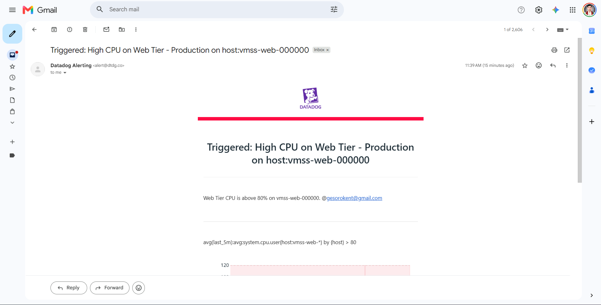
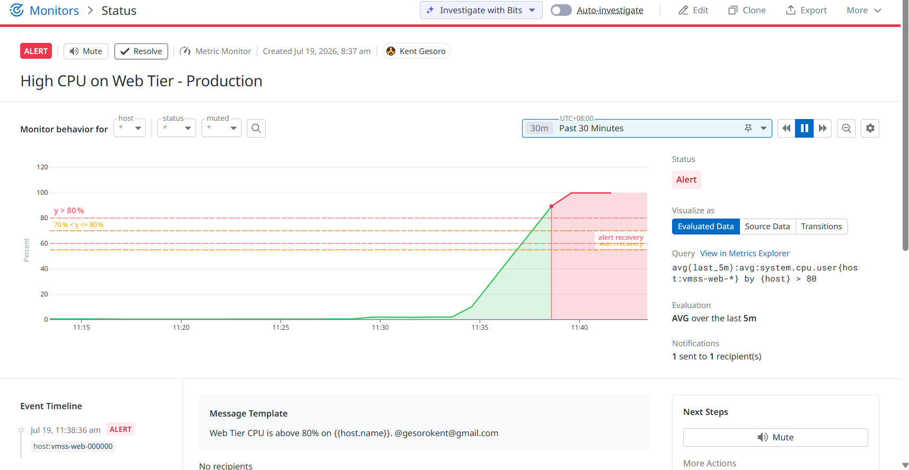
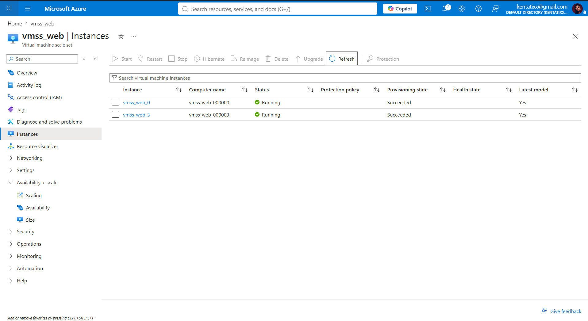
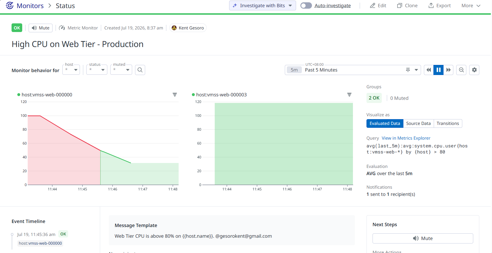
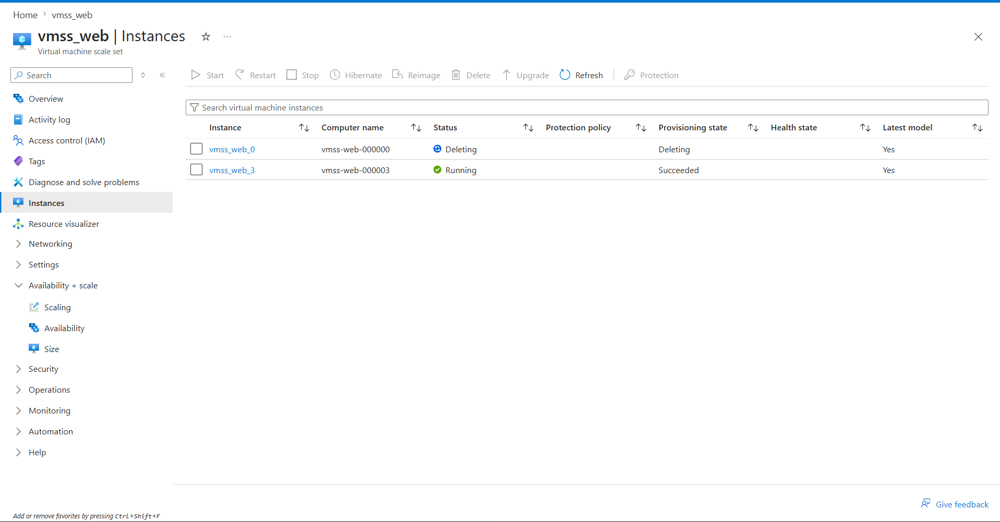
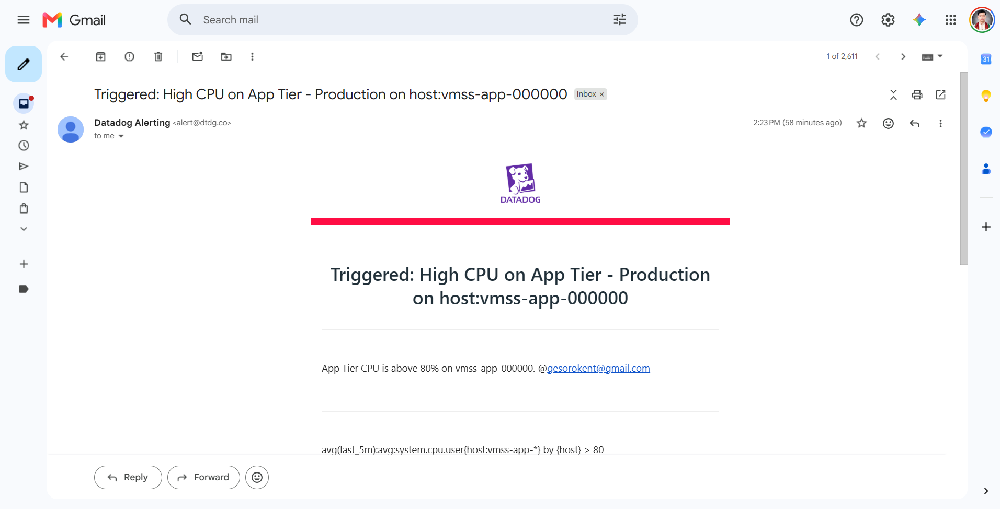
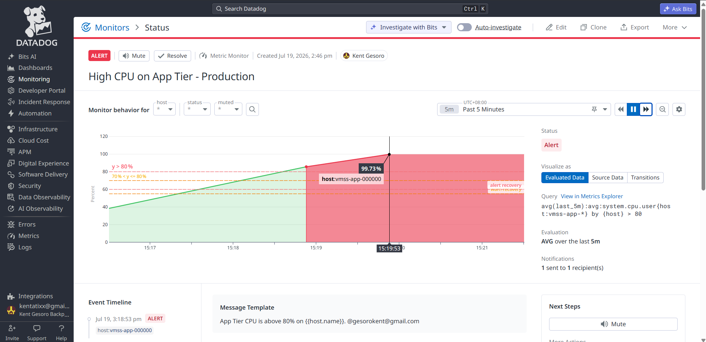
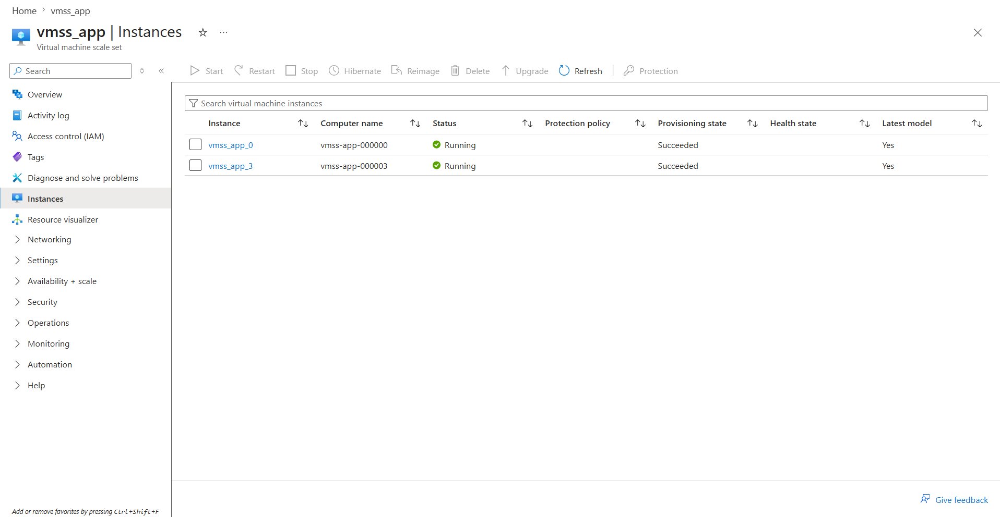
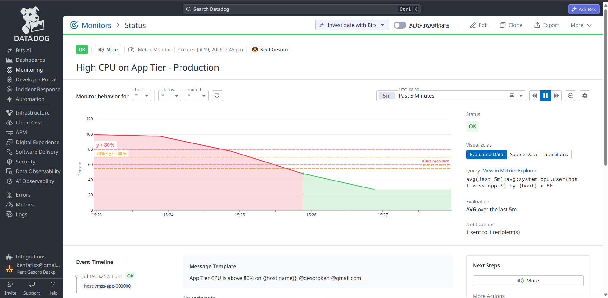
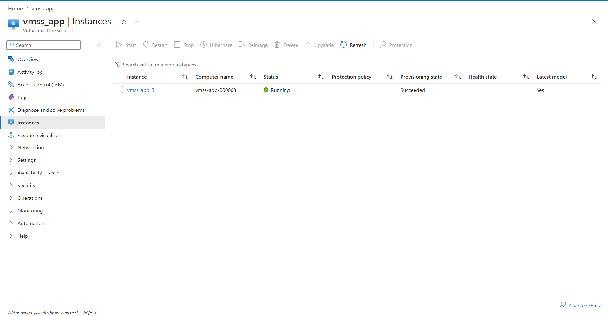

# Azure Hub-Spoke: IaaS Three-Tier E-Commerce Application with Autoscaling & IaC

> Self-scaling three-tier Azure infrastructure for an online storefront, built with Terraform, monitored by Datadog, secured with Bastion-only administration and Key Vault-managed secrets, and delivered through OIDC-authenticated CI/CD.

---

##  Business Scenario

A growing e-commerce company operates an online storefront where customers browse products and access backend application services.

During promotional campaigns, payday sales, and product launches, traffic can increase significantly. The company requires a secure and scalable three-tier architecture that can automatically respond to changing demand while protecting sensitive application and database resources.

---

## Business Problems

This project addresses several common operational challenges faced by organizations.

### Problem 1 — Traffic Spikes During Sales Events

During major e-commerce events such as promotional campaigns, payday sales, and product launches, customer traffic can increase significantly.

**Result:**

- High CPU utilization
- Slower application response times
- Potential impact on customer experience

**Solution:** Azure Monitor Autoscale automatically adds or removes Web and App VM instances based on CPU utilization.

---

### Problem 2 — Single-Tier Application Architecture

Running the web server, application logic, and database on the same infrastructure makes it difficult to scale and secure the platform.

**Result:**

- A failure can impact the entire application.
- Components cannot scale independently.
- Database access may be unnecessarily exposed.

**Solution:** Separate the platform into dedicated Web, App, and Database tiers with independent networking, security, and scaling.

---

### Problem 3 — Manual Infrastructure Provisioning

Manually creating cloud resources through the Azure Portal can lead to inconsistent configurations and slow deployments.

**Result:**

- Infrastructure deployments take longer.
- Rebuilding the environment requires significant manual effort.
- Infrastructure changes are more difficult to track.

**Solution:** Terraform defines the infrastructure as code using reusable modules for networking, compute, load balancing, databases, storage, shared services, and monitoring.

---

### Problem 4 — Lack of Monitoring

Without centralized monitoring, infrastructure problems may not be detected quickly.

**Result:**

- High resource usage can go unnoticed
- Slower incident response

**Solution:** Datadog monitors CPU utilization, provides dashboards, and sends alerts when CPU usage exceeds critical thresholds.

---

## Solution Architecture

---

## Autoscaling in Action

> Azure Monitor Autoscale triggers capacity changes when average CPU exceeds 60%, while Datadog provides independent monitoring and alerts when CPU utilization exceeds 80%.

### VMSS_WEB

During a flash sale event, the infrastructure responds automatically through five observable stages:

1. **Alert Triggered** — Datadog sends an email alert when CPU usage exceeds 80%.
   

2. **Metric Spike** — The Datadog dashboard shows CPU climbing into the red zone.
   

3. **Scale-Out** — Azure Portal confirms a second VM instance has been provisioned.
   

4. **Recovery** — CPU drops back into the green zone as load balances across instances.
   

5. **Scale-In** — Azure Portal shows the extra VM automatically removed to optimize cost.
   

### VMSS_APP

1. **Alert Triggered** — Datadog sends an email alert when CPU usage exceeds 80%.
   

2. **Metric Spike** — The Datadog dashboard shows CPU climbing into the red zone.
   

3. **Scale-Out** — Azure Portal confirms a second VM instance has been provisioned.
   

4. **Recovery** — CPU drops back into the green zone as load balances across instances.
   

5. **Scale-In** — Azure Portal shows the extra VM automatically removed to optimize cost.
   

---

## Architecture Overview

The solution combines network segmentation, three-tier compute, automated scaling, secure administration, private data services, and independent observability.

### Azure Networking

- Hub Virtual Network (Application Gateway subnet, Azure Bastion subnet)
- Storefront Virtual Network (storefront compute subnet)
- Checkout Virtual Network (checkout compute subnet, delegated order-database subnet)
- Full-mesh peering between all three VNets
- Network Security Groups on every subnet

The network isolates each tier while full-mesh peering and NSGs enforce least-privilege communication between them.

### Secure Administration

Cloud engineers connect through Azure Bastion in the hub network. Neither the storefront nor the checkout VM Scale Set ever receives a Public IP address, significantly reducing the attack surface around customer and order data.

### Outbound Connectivity

A dedicated Azure NAT Gateway per tier provides outbound-only Internet access, letting storefront and checkout instances install packages and reach Azure services without exposing themselves publicly.

### Compute & Autoscaling Layer

Two Linux VM Scale Sets — storefront (nginx reverse proxy) and checkout (Flask order-processing API) — use Azure Monitor Autoscale rules to add an instance above 60% average CPU and remove one below 30%, with a five-minute cooldown in each direction.

### Load Balancing

Azure Application Gateway (Standard_v2) automatically scales between 2 and 5 instances and forwards public shopper traffic to the storefront tier. An internal Standard Load Balancer distributes private traffic from the storefront tier to the checkout VM Scale Set.

### Data Layer

The order database runs on PostgreSQL Flexible Server in a delegated subnet within the checkout VNet, with public network access disabled and a private DNS zone for resolution — customer and order data is unreachable from anywhere outside that network.

### Secrets Management

Azure Key Vault stores Terraform-generated SSH keys and the generated PostgreSQL database password. Sensitive credentials are not hard-coded or committed to source control.

### Observability

The Datadog Agent runs on every instance in both scale sets. Datadog provides CPU monitoring, dashboards, and alerts, while Azure Monitor Autoscale independently evaluates CPU metrics and performs the scale-out and scale-in actions.

### CI/CD Pipeline

**Continuous Integration** — every Pull Request runs Terraform Format Check, Terraform Validate, and Terraform Plan, authenticated to Azure via OIDC federation rather than a stored credential.

**Continuous Deployment** — after merging into `main`, the pipeline applies the infrastructure change directly, also authenticated via OIDC.

---

## Technologies Used

- Microsoft Azure
- Terraform
- GitHub Actions
- Azure Application Gateway
- Azure Load Balancer
- Azure Virtual Machine Scale Sets
- Azure Monitor Autoscale
- Azure Database for PostgreSQL Flexible Server
- Azure Key Vault
- Azure Bastion
- Azure NAT Gateway
- Azure Virtual Network / Network Security Groups
- Azure Storage Account
- Datadog (Agent, Monitors, Dashboards)
- nginx
- Python / Flask

---

## Skills Demonstrated

- Infrastructure as Code
- Azure Networking
- Autoscaling & Capacity Planning for Peak Retail Traffic
- Cloud Security
- Identity and Secrets Management
- Linux Administration
- CI/CD Automation
- Infrastructure Monitoring
- Terraform Module Design
- Infrastructure Documentation

---

## Lessons Learned

This project demonstrates how a self-scaling e-commerce platform can be built on Azure while maintaining network segmentation, secure administration, and centralized observability.

Key lessons include:

- Autoscaling and observability solve different but connected problems. Azure Monitor Autoscale performs scaling actions, while Datadog provides independent monitoring, dashboards, and alerting.
- Network segmentation is essential for protecting sensitive resources such as the order database.
- Azure Bastion removes the need to expose SSH directly to the internet.
- Key Vault improves secret management by avoiding hard-coded credentials.
- Terraform modules improve infrastructure consistency and maintainability.
- CI/CD with GitHub Actions and OIDC provides a more secure and repeatable deployment workflow.

The project demonstrates how an e-commerce platform can absorb traffic spikes during sales events without relying on manual scaling or exposing private infrastructure directly to the public internet.